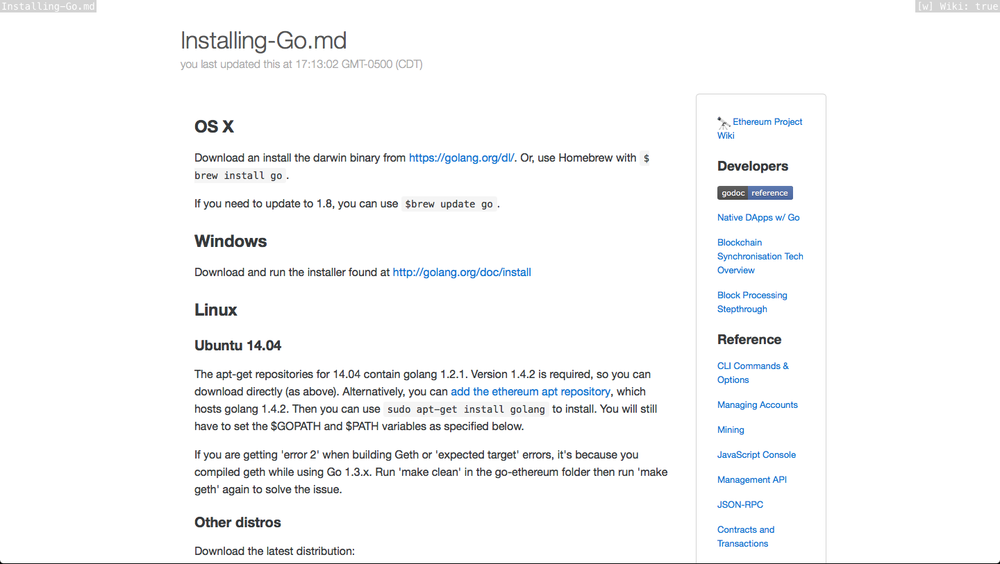

# Wub



> Delivers live-reloaded markdown files from a directory to your browser,
automatically updating to show you the one you're working on.

The project was begun with editing Github Wiki pages in mind. Style
mimics Github as closely as my patience allows.

### Installation
```shell
$ go get github.com/rotblauer/wub/...
$ go install github.com/rotblauer/wub
$ which wub
> $GOPATH/bin/wub
```

### Usage
Wub is simple. Point it a directory and run.

```shell
$ cd my/markdown/directory
$ wub

# or

$ wub --port 3001 my/markdown/directory
```

It will open with (in order of priority):
- README.md
- Home.md
- the first .md/.markdown/.mdown file it finds that's not prefixed with "_"

Then, just edit any file in that directory and wub will detect that change and render it.

Relative links will be functional, i.e. `./Instructions.md`.

#### Wiki mode
Press `w`, or click the light gray button "Wiki: [on|off]" in the top right
to toggle Github Wiki page style layout, which renders `_Sidebar.md` and
`_Footer.md` in their respective places.

### Limitations and ~~shit~~ hit list
- It does not traverse the directory recursively.
- It is not very clever about file names and titles (with regard to links and titles); it doesn't handle ambiguity well.
As far as it goes so far is appending ".md" to links without that extension.
- It would be really great if it were clever about absolute href/urls, so "hardcoded" wiki links could
be toggled to relative paths if they exits. Not _yet_.
- It does not scroll for you to your current changes... not sure if that's a limitation or a feature.